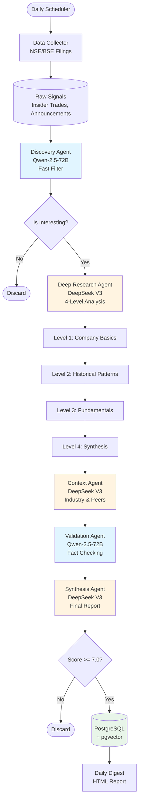

# Value Investing Multi-Agent Research System

A self-hosted multi-agent AI system that discovers and researches special situation investing opportunities in Indian markets (NSE/BSE).

## Features

- **Autonomous Discovery**: Monitors NSE/BSE filings daily for insider trading, corporate announcements, and board meetings.
- **Deep Research**: 4-level investigation agents (Context, History, Fundamentals, Synthesis) driven by DeepSeek V3.
- **Persistent Memory**: Uses PostgreSQL with `pgvector` for semantic search and Redis for caching.
- **Learning System**: Feedback loop trains a Reward Model to personalize recommendations over time.
- **Local Deployment**: Fully containerized with Docker Compose.

## Architecture

The system uses **LangGraph** to orchestrate a multi-agent research pipeline with conditional routing and state management.



### Key Components

1.  **Data Collector**: Scrapes NSE and Screener.in for signals
2.  **Discovery Agent** (Qwen-2.5-72B): Fast, cost-effective filtering
3.  **Deep Research Agent** (DeepSeek V3): Multi-level comprehensive analysis
4.  **Context Agent** (DeepSeek V3): Industry trends and peer comparison
5.  **Validation Agent** (Qwen-2.5-72B): Fact-checking and consistency validation
6.  **Synthesis Agent** (DeepSeek V3): Generates structured investment memos
7.  **Quality Filter**: Only insights scoring ≥7.0 are saved

## Prerequisites

- Python 3.11+
- Docker & Docker Compose
- API Keys:
    - **OpenRouter API Key**: Single key to access both DeepSeek (Research) and Qwen (Discovery) models.

## Installation

1.  **Clone the repository**:
    ```bash
    git clone <repo_url>
    cd value-investing-agents
    ```

2.  **Configure Environment**:
    Copy `.env.example` to `.env` (or just edit `.env` if created):
    ```bash
    # Edit .env with your API keys
    nano .env
    ```

3.  **Start Infrastructure**:
    ```bash
    docker-compose up -d
    ```

4.  **Install Python Dependencies**:
    ```bash
    pip install -r requirements.txt
    ```

    *Note: You may need to install Playwright browsers:*
    ```bash
    playwright install
    ```

5.  **Initialize Database**:
    The database should initialize automatically via docker-compose, but if needed:
    ```bash
    psql -h localhost -U researcher -d value_investing_research -f scripts/init_db.sql
    ```

## Usage

### Run Daily Research
Manually trigger the daily research pipeline:
```bash
python3 scripts/daily_run.py
```
This will collect signals, run agents, and generate a daily digest in `/tmp/daily_digest_YYYYMMDD.html`.

> **Note**: The first run will download ~1.5GB of embedding models. This may take a few minutes depending on your internet connection.

### Rate Insights
Start the feedback UI to rate generated insights and train the model:
```bash
python3 -m src.feedback.collector
```
Open [http://localhost:5000](http://localhost:5000) in your browser.

### Automated Scheduling
To run the scheduler in the background:
```bash
python3 scripts/scheduler.py
```

## Project Structure

```
value-investing-agents/
├── docker-compose.yml      # Infrastructure
├── .env                    # Config
├── src/
│   ├── agents/             # Agent logic (Discovery, Research, etc.)
│   ├── graph/              # LangGraph workflow
│   ├── memory/             # Postgres & Redis managers
│   ├── models/             # LLM & Embedding clients
│   ├── scrapers/           # NSE & Screener scrapers
│   └── feedback/           # Flask app
├── scripts/                # Execution scripts
└── data/                   # Docker volumes
```
